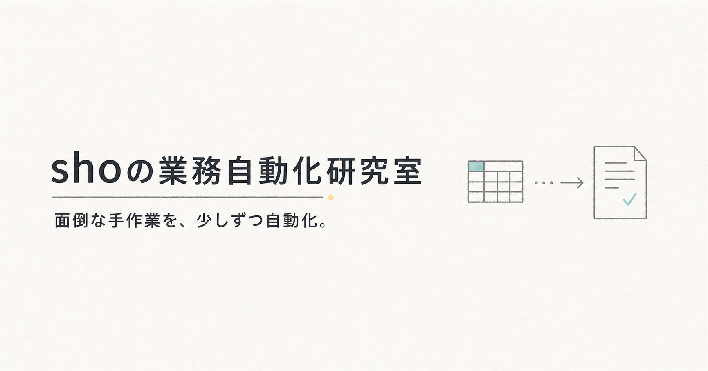

# shoの業務自動化研究室

Excel・CSVの整理、公開情報リサーチ、集計自動化などの自主制作物を紹介するポートフォリオサイトです。

[公開サイトを見る](https://sho-ailab.com)



## 主な内容

- データクリーニングの作業例
- 公開情報リサーチと一覧化の作業例
- 売上集計ダッシュボードの作業例
- 各制作物の入力、処理、出力、確認方法
- PC、タブレット、スマートフォンに対応した画面

掲載データは架空データまたは確認可能な公開情報です。実案件の機密情報やクライアント資料は使用していません。

## 使用技術

- Next.js 16 / React 19 / TypeScript
- HTML / CSS
- Node.js Test Runner
- Vercel

## ローカル実行

```bash
npm install
npm run dev
```

`http://localhost:3000`をブラウザで開いて確認します。

## 確認コマンド

```bash
npm run lint
npm test
```

`npm test`では本番ビルド後、主要ページのHTML、画像参照、リンク、表示内容を自動確認します。
